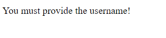

# Twitter Friends map

Project, which creates friends map based on the data from Twitter API.

Creates a map with markers indicating locations of accounts followed by given username.

## How to use

1. Start the web application if you are host or just go to its url
2. Enter the username of account, whose friends map we want to watch.

## Result
If everything goes OK, you will see a map with markers:

General view:

By clicking on markers, you can see the name of the profile, which is located here:

## Errors
It is possible that error will appear. In that case you will be redirected to a specific page with the message about the error.

##Twitter API token
For security purposes, Twitter API token is saved in the .env file, so if you want to use the app, you should create your own .env file with your token stated there.
## License
[MIT](LICENSE.txt)
